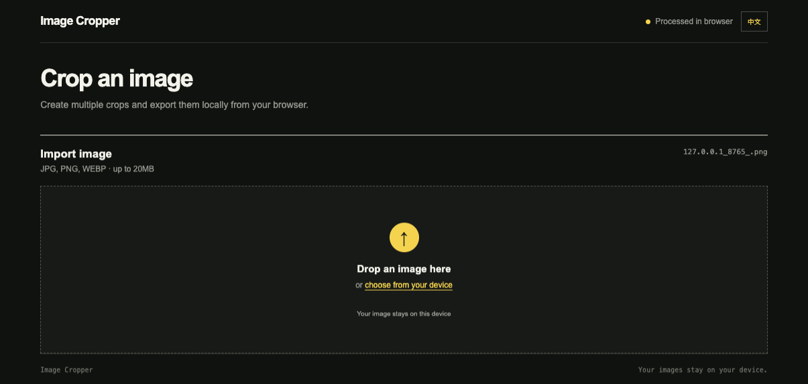
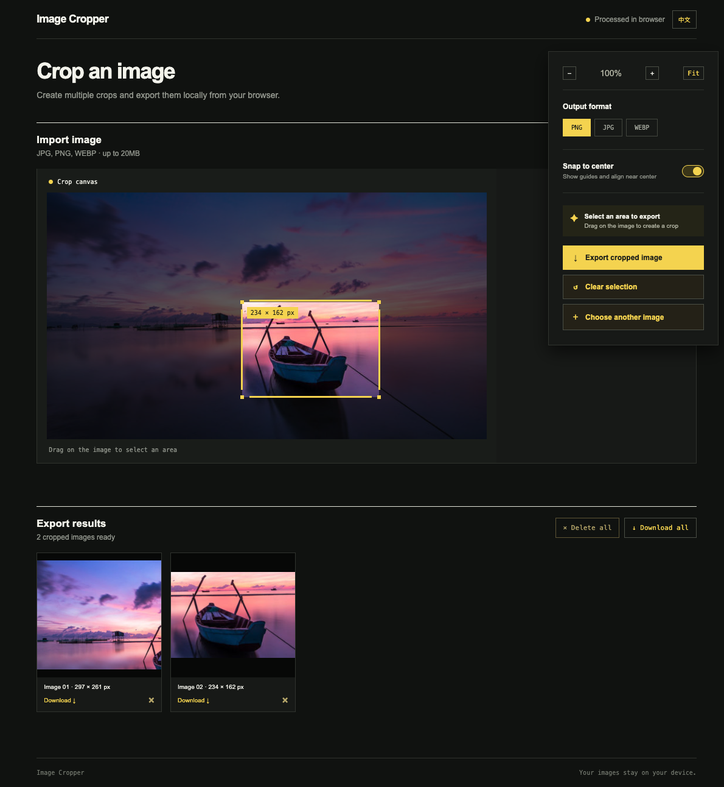

# Image Cropper

Image Cropper is a small, dependency-free image cropper that runs entirely in the browser. It lets you create crop results from an image and export them without uploading the original file anywhere.

## Interface preview

## Features

- Open common image formats: JPG, PNG, WEBP, and GIF
- Drag the top, right, bottom, or left edge independently
- Move the crop selection as a whole
- Zoom the canvas in and out, or return to Fit view
- Keep the crop selection inside the image canvas
- Export multiple cropped images as PNG, JPG, or WEBP without overwriting earlier results
- Download individual results or all results together
- Delete individual results or clear the entire export list
- Switch between English and Simplified Chinese
- Works offline after the file is downloaded

## Run

No installation or build step is required. Open [`image-cropper.html`](image-cropper.html) in a modern browser.

The tool uses browser APIs only. Image decoding, cropping, and export happen locally through the File API, Pointer Events, and Canvas API.

## Privacy

Images are never sent to a server by this tool. The selected file is read locally by the browser and the exported image is created locally as a data URL.

## Notes

- The browser determines the final WEBP encoding support.
- JPG exports use a white background for transparent source images.
- Large images may use significant browser memory while exporting.

---

# Image Cropper — 图片裁切工具

Image Cropper 是一个轻量、无依赖的浏览器图片裁切工具。它可以从一张图片中选取裁切区域并导出多个结果，原始图片不会上传到任何服务器。

## 界面预览

## 功能

- 支持 JPG、PNG、WEBP 和 GIF 等常见图片格式
- 上、右、下、左四条边可以分别拖拽调整
- 可以整体移动裁切区域
- 支持放大、缩小和恢复 Fit 全图视图
- 裁切框不会超出图片画布
- 支持连续导出多张 PNG、JPG 或 WEBP，之前的结果不会被覆盖
- 支持单张下载或一次下载全部结果
- 支持删除单张结果或清空全部导出结果
- 支持英文和简体中文切换
- 下载后无需网络即可使用

## 使用

无需安装依赖，也无需构建。使用现代浏览器直接打开 [`image-cropper.html`](image-cropper.html) 即可。

工具只使用浏览器原生能力：通过 File API 读取图片，使用 Pointer Events 处理拖拽，并通过 Canvas API 完成本地裁切和导出。

## 隐私

图片不会发送到服务器。浏览器只在本地读取你选择的文件，并在本地生成导出的图片。

## 说明

- WEBP 的最终编码能力取决于浏览器支持情况。
- JPG 导出会为透明图片使用白色背景。
- 超大图片在导出时可能占用较多浏览器内存。
